# Theory:

A ***Karnaugh Map*** provides a pictorial method of grouping together expressions with common factors and therefore eliminating unwanted variables. The Karnaugh map can also be described as a special arrangement of a truth table.

## K-maps for Sum-of-Product Design

A minimal sum-of-product design can be created as follows:

- Create the K-map, entering a 1 or 0 in each square according to the desired logic function
- Beginning with large rectangles and going to small rectangles, add rectangles until all minterms are 'covered' (all '1's are included).
- Generate the algebraic terms corresponding to the rectangles

### Examples:

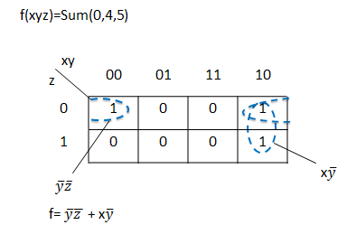

## K-maps for Product-of-Sum Design

Product-of-sums design uses the same principles, but applied to the zeros of the function.

### Examples:

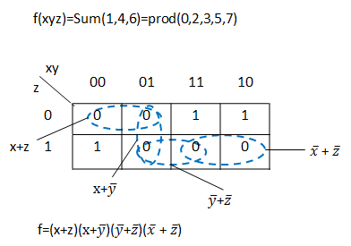

## Designing with Don't-Care Values

In some situations, we don't care about the value of a logic function.
For example, if we use wxyz to represent a number from 0 to 9, we need not worry about the function value produced for wxyz = 10...15.
For these situations, the function can be assigned an output in order to make the resulting circuit as simple as possible
Suppose we wish to implement the function f(wxyz)=Sum(3,5,6,7)and we have the don't-care condition of d=Sum(10,11,12,13,14,15).

### The sum-of-products implementation:

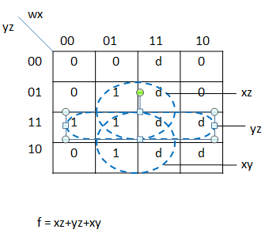

### The product-of-sums implementation:

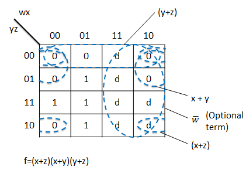

### Karnaugh Maps-Rules of Simplification

The Karnaugh map uses the following rules for the simplification of expressions by grouping together adjacent cells containing ones

- Groups may not include any cell containing a zero

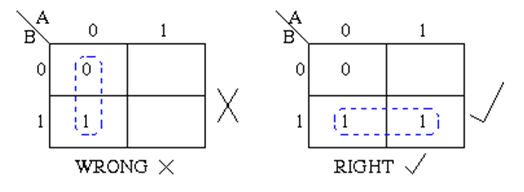

- Groups must contain 1, 2, 4, 8, or in general 2n cells. That is if n = 1, a group will contain two 1's since 21 = 2. If n = 2, a group will contain four 1's since 22 = 4.

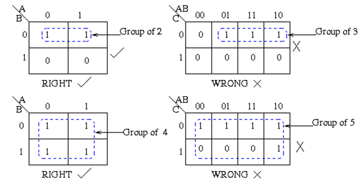

- Each group should be as large as possible.

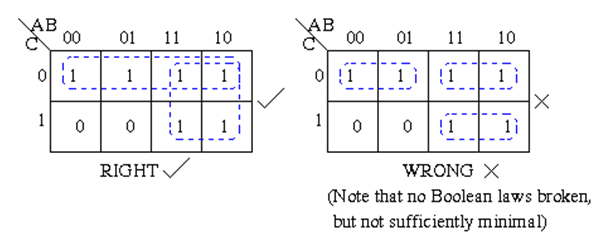

- Each cell containing a one must be in at least one group.

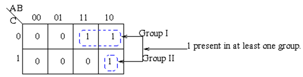

- Groups may overlap.

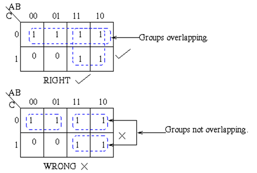

- Groups may wrap around the table. The leftmost cell in a row may be grouped with the rightmost cell and the top cell in a column may be grouped with the bottom cell.

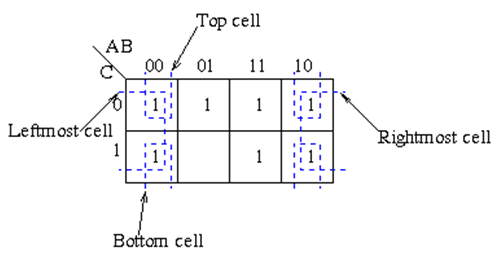

- There should be as few groups as possible, as long as this does not contradict any of the previous rules.

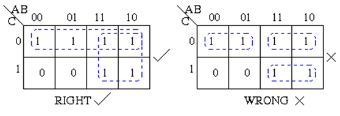

Karnaugh maps are used to simplify real-world logic requirements so that they can be implemented using a minimum number of physical logic gates. A sum of product expression can always be implemented using AND gate feeding into an OR gate, and a product of sum expression leads to OR gates feeding an AND gate.

